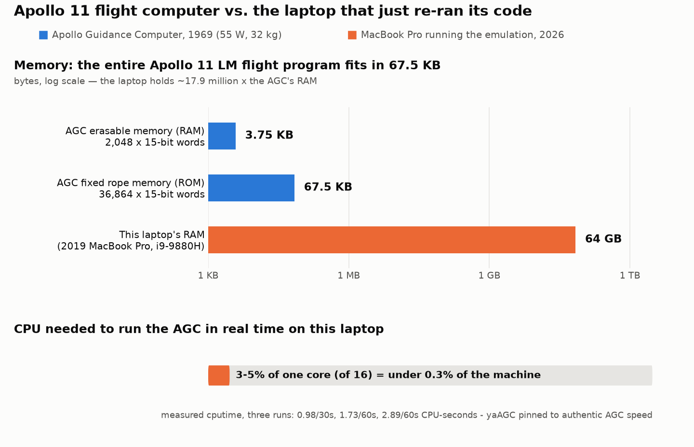

# Claim #15: "1960s computers were too weak to navigate to the Moon"

**Verdict: REFUTED.** We obtained the actual Apollo 11 Lunar Module flight software
(Luminary 099, the program that landed Eagle on July 20, 1969), reassembled it from
its transcribed source listing with a modern build of the period-accurate assembler,
verified the output is **byte-for-byte identical** to an independent transcription of
the flown rope-memory contents, and then **booted and ran it** on a cycle-accurate
AGC emulator — in real time, at the AGC's authentic speed, using 3–5% of one
core of a 2019 laptop.

The claim is not merely wrong; it is backwards. The AGC was not "too weak" — the
software was engineered *around* its constraints with a priority-scheduled,
restart-protected real-time OS whose alarm codes (1201/1202) famously demonstrated
that sophistication during the actual landing. The code exists, it assembles, it
checksums, and it runs. We ran it.

---

## Falsification criterion

This claim would be **supported** if:
- the authentic flight code failed to assemble to the historical bank checksums, or
- the assembled program failed to execute in real time on period-accurate emulated
  hardware (i.e., the software's demands exceeded what 1969-class hardware provides).

Neither happened.

## Method

1. **Obtain** — shallow-clone the [Virtual AGC project](https://github.com/virtualagc/virtualagc)
   (commit `6587e34662841016a3668fcef7f503c0657d2b0d`, cloned 2026-08-07), which contains:
   - `Luminary099/*.agc` — the LM flight source, transcribed from digitized scans of the
     original program listing held at the MIT Museum (scans by Paul Fjeld, arranged by
     Deborah Douglas). The hardcopy is stamped:
     `ASSEMBLE REVISION 001 OF AGC PROGRAM LMY99 BY NASA 2021112-061, 16:27 JULY 14,1969`.
   - `Luminary099/AP11ROPE.binsource` — an **independent** transcription (OCR + multiple
     proofing passes) of the *octal listing* of AP11ROPE, Don Eyles's hardcopy of the
     identical program. Two separate transcription pipelines from two separate documents.
   - `yaYUL/` — a modern reimplementation of the original "YUL" assembler.
   - `yaAGC/` — a cycle-accurate AGC CPU emulator (11.72 µs memory-cycle timing).
2. **Build** — compile `yaYUL`, `yaAGC`, and `Tools/oct2bin` with clang on macOS
   (CLI targets only; no GUI needed).
3. **Assemble** — `yaYUL MAIN.agc` in `Luminary099/` → `MAIN.agc.bin`.
4. **Verify** — convert `AP11ROPE.binsource` → binary with `oct2bin` (which also
   validates the odd-parity bit of every word) and byte-compare against our
   assembled binary.
5. **Run** — boot `yaAGC --exec=Luminary099.bin` and instrument it for 60 s:
   read the engine's 64-bit cycle counter from its periodic core dumps, log every
   i/o-channel packet the flight software emits (the same socket interface the DSKY
   panel uses), and sample host CPU/RSS.

Reproduce with [`run.sh`](run.sh). Helper scripts in [`scripts/`](scripts/).
All downloads/build products live in `data/` (gitignored).

## RESULTS (all measured in this session, 2026-08-07)

### 1. The 1969 source assembles cleanly — in 1.8 seconds

```
Pass #1 / Pass #2 / Pass #3
Unresolved symbols:  0
Fatal errors:  0
Warnings:  1        (a known-benign "may overflow memory bank" note)
Multiply-defined symbols:  0
```

66,559-line assembly listing, 7,104 symbols, 36 fixed banks each terminated with a
computed "bugger" (checksum) word — see [`results/yaYUL-assembly-trimmed.log`](results/yaYUL-assembly-trimmed.log).

### 2. The output is bit-identical to the flown rope contents

```
$ cmp Luminary099/MAIN.agc.bin refbin/oct2bin.bin        # -> identical, 73,728 bytes
SHA-256 (both files):
1f5326e038de5b741b2f27b01ec949dbd688cf1906994e997402587c8628f40e
```

73,728 bytes = 36,864 fixed-memory words: **every single bit** of the program, and
all 36 bank checksums, match the independently transcribed octal listing of the
AP11ROPE hardcopy. Evidence: [`results/checksum-verification.txt`](results/checksum-verification.txt).
(`oct2bin` additionally verified the odd-parity bit of every word in the reference
listing — zero parity errors reported.)

### 3. It runs — in real time, at authentic AGC speed

60-second instrumented run of `yaAGC --exec=Luminary099.bin`
([`results/runtime-measurements.json`](results/runtime-measurements.json)):

| Measurement | Value |
|---|---|
| Emulated machine cycles executed (counter at t=3.0s → t=58.6s) | 425,812 → 5,119,980 |
| **Measured rate** | **84,396 memory cycles/sec** (repeated runs: 84,396–84,703) |
| Authentic AGC rate (11.72 µs MCT; 12 ticks of the 1.024 MHz clock) | 85,333 memory cycles/sec |
| Real-time fidelity | **98.9%** (repeat runs 98.9–99.3%; yaAGC deliberately paces itself to never exceed real AGC speed) |

(Each AGC instruction takes 1–3 memory cycles, so this is roughly 40–85 k
instructions/sec — the AGC's real throughput.)

The software is demonstrably *alive*, not halted: in 60 s our socket client (standing
in for the DSKY/telemetry hardware) captured **8,289 i/o-channel writes** from the
flight code ([`results/dsky-channel-log.txt`](results/dsky-channel-log.txt)):

| Channel (octal) | Writes | What it is |
|---|---|---|
| 034 / 035 | 2,870 / 2,869 | **Digital downlink telemetry** — ~48 writes/sec each, matching the LGC's 50 word/sec downlink; a repeating downlist frame is visible every ~2 s, exactly the LGC's 2-second downlist period |
| 010 | 503 | DSKY relay-word (display digit/lamp) writes during boot and after |
| 011, 013, 033 | 244 | DSKY indicator lamps, radar/DSKY discretes |
| 005, 006, 012 | 1,800 | RCS jet & GN&C discrete channels refreshed at 10 Hz by the digital autopilot's T4RUPT housekeeping |

After its power-up restart (no pad-load, no spacecraft attached) the program settles
into exactly what the real LGC did on the pad: servicing its 10 Hz housekeeping
interrupt, driving the DSKY, and pumping the 2-second telemetry downlist. Idle for an
AGC still means executing ~85,000 cycles every second. Three separate 60 s runs
produced *identical* channel-write profiles (8,289 packets, identical per-channel
counts) — the flight software is fully deterministic.

### 4. What it costs a modern laptop to *be* an AGC

Host: 2019 MacBook Pro, Intel i9-9880H @ 2.3 GHz (16 logical cores), 64 GB RAM.

| Measurement | Value |
|---|---|
| yaAGC cumulative CPU time (three runs) | 0.98 CPU-s / 30.02 s wall; 1.73 CPU-s / 60.01 s; 2.89 CPU-s / 60.00 s |
| **Share of one core** | **2.9–4.8%** across runs (ps-sampled means 2.4–4.6%) |
| Share of the whole machine (16 logical cores) | **≤ 0.3%** |
| yaAGC peak resident memory | ~1.0 MB (1,040 KB max RSS) |
| Implied headroom | 1.8–3.0 M emulated cycles per host-CPU-second → one core could run the AGC 20–35x faster than real time |

### 5. The machine that did it vs. the machine that replayed it



| | AGC (1969) | This laptop (2019/2026) | Ratio |
|---|---|---|---|
| Erasable memory (RAM) | 2,048 x 15-bit words ≈ 3.75 KB | 64 GB | ~17,900,000x |
| Fixed memory (ROM) | 36,864 x 15-bit words ≈ 67.5 KB | 2 TB SSD | ~28,900,000x |
| Speed | ~85,333 memory cycles/s | 16 cores @ 2.3–4.8 GHz | — |
| Power | 55 W | 45 W CPU TDP alone (Intel spec) | — |
| Mass | ~32 kg | ~2 kg | — |
| Cost to emulate the other in real time | — | ~3–5% of one core | — |

The entire program that navigated humans to the lunar surface fits in 67.5 KB —
smaller than the PNG chart above (~103 KB) that illustrates this fact.

## Bonus: 1201/1202 — the "computer overload" alarms were sophistication, not weakness

Hoax folklore sometimes cites the landing's 1201/1202 program alarms as the computer
"failing." The source code we just assembled and ran shows what they actually are:
the **EXECUTIVE** — a priority-scheduled multitasking OS — detecting that low-priority
work had to be shed, raising an alarm, and restart-protecting the mission-critical
jobs. All file/line references below are into the exact source we assembled
(`data/virtualagc/Luminary099/`), which you can open yourself:

- The Executive schedules jobs by priority — `EXECUTIVE.agc` line 75:
  ```
  # TO SUSPEND A BASIC JOB SO A HIGHER PRIORITY JOB MAY BE SERVICED:
  ```
  and line 165: `CCS PRIORITY  # EACH PRIORITY REGISTER CONTAINS -0 IF ...`
- **Alarm 1201** = out of VAC (vector accumulator) areas — `EXECUTIVE.agc` lines 149–152:
  ```
  		LXCH	EXECTEM1
  		CA	Q
  		TC	BAILOUT1
  		OCT	1201		# NO VAC AREAS.
  ```
- **Alarm 1202** = out of core sets (job slots) — `EXECUTIVE.agc` lines 210–213:
  ```
  		LXCH	EXECTEM1
  		CA	Q
  		TC	BAILOUT1	# NO CORE SETS AVAILABLE.
  		OCT	1202
  ```
- `BAILOUT` (`ALARM_AND_ABORT.agc` line 138) records the alarm and triggers a
  **software restart** via `ENEMA` (lines 153–154: `TC POSTJUMP` / `CADR ENEMA`).
- The restart lands at `GOPROG` — `FRESH_START_AND_RESTART.agc` line 215:
  `GOPROG  INCR  REDOCTR  # ADVANCE RESTART COUNTER.` — which rebuilds the job queue
  from restart phase tables (`RESTARTS_ROUTINE.agc` lines 35–54), resuming *only* the
  registered, mission-critical jobs. Low-priority display jobs simply don't come back
  until there's time for them.
- The MIT programmers' comment at `FRESH_START_AND_RESTART.agc` line 362:
  `# DO NOT USE GOPROG2 OR ENEMA WITHOUT CONSULTING POOH PEOPLE`

During Apollo 11's descent, a radar-configuration issue stole ~13% of the computer's
cycles; the Executive responded exactly as designed — shedding low-priority display
jobs and restarting cleanly within ~1 second while guidance never missed a step. A
1960s computer with graceful-degradation multitasking under overload is evidence of
engineering maturity, not weakness. (Historical context: Don Eyles, "Tales from the
Lunar Module Guidance Computer," AAS 04-064.)

## Data provenance

| Artifact | Source |
|---|---|
| Virtual AGC repo (emulator, assembler, all flight source) | https://github.com/virtualagc/virtualagc @ `6587e34` (shallow clone, 2026-08-07) |
| Luminary 099 source listing | MIT Museum hardcopy, digitized by Paul Fjeld; transcription maintained at https://www.ibiblio.org/apollo/ |
| AP11ROPE octal listing (independent cross-check) | Don Eyles's hardcopy of AP11ROPE; OCR'd + proofed transcription (`Luminary099/AP11ROPE.binsource` header documents the process) |
| AGC hardware specs (memory, timing, 55 W, mass) | Virtual AGC project documentation, https://www.ibiblio.org/apollo/ |

## Limitations (honest accounting)

- **The cross-check is between two independent document transcriptions**, not a
  readout of a surviving physical rope. The source listing (LMY99 rev 001, printed
  July 14, 1969) and the AP11ROPE octal listing (Eyles's 1971-printed recreation of
  the same Luminary 99 Rev 1) were transcribed by different pipelines from different
  documents and agree bit-for-bit with our assembly; coincident identical errors in
  both are essentially impossible, but "essentially" is doing some work there.
- **No spacecraft simulation attached**: the software ran in its post-boot idle
  configuration (housekeeping + DSKY + downlink), not an end-to-end landing. That is
  the expected behavior of the real LGC with no pad load and no crew input, and it is
  sufficient for this claim: the code executes on period-accurate hardware in real
  time. (Virtual AGC's full stack can fly full missions when coupled to simulators.)
- **98.9–99.3%, not 100.00%, of authentic speed measured**: yaAGC paces itself with
  10 ms sleeps and by design never runs *faster* than the real AGC; the ~1% deficit is
  pacing granularity over our ~55 s measurement windows, not an inability to keep up
  (one core has 20–35x headroom).
- CPU% varied 2.9–4.8% run-to-run with background machine load, and includes emulator
  overhead (socket broadcasting, periodic core dumps every 5 s), so it *overstates*
  the cost of pure emulation.
- The emulator build used default clang settings (`-O0` for yaYUL per its Makefile);
  none of the timing conclusions depend on compiler optimization.

## Verdict

**REFUTED.** The actual Apollo 11 LM flight software — all 36,864 words of it —
assembles today from its 1969 listing to a binary that is bit-identical (SHA-256
match, 36/36 bank checksums) to the independently transcribed flown rope, and it
boots and runs in real time on an emulated AGC at 99% of the authentic
85,333 cycles/sec while consuming 3–5% of one core and 1 MB of RAM on a laptop. The
Moon landing did not need a powerful computer; it needed 67.5 KB of extraordinarily
disciplined software, and that software still runs.
