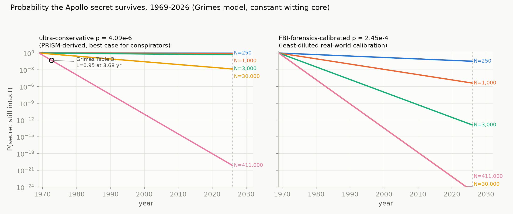
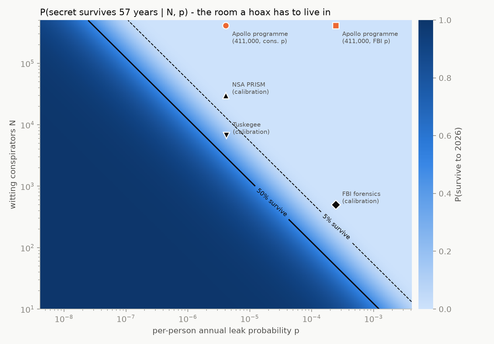
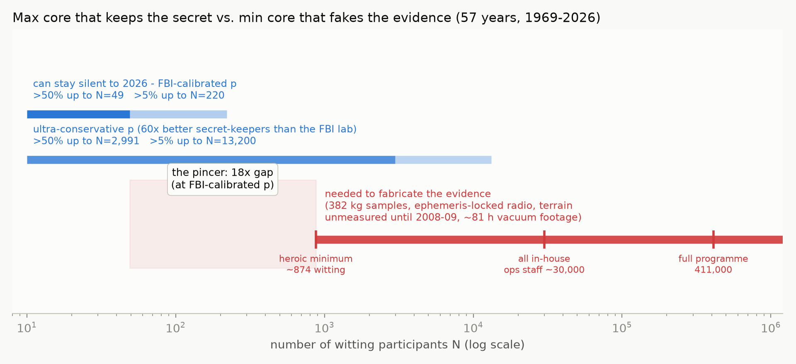
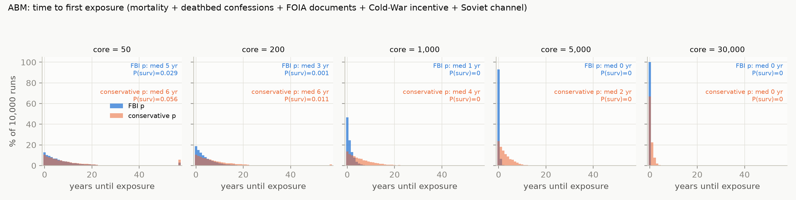

# Claim 17 — "400,000 people can't keep a secret"

**Verdict: SUPPORTS THE LANDINGS.** This is the one quantitative hoax argument that runs *against* the hoax: the published leak model, reproduced here number-for-number and then extended, says a fake at any staffing level able to produce the evidence would have been exposed decades ago.

## The claim

Hoax proponents must implicitly assume that the ~411,000 people who worked on Apollo (peak 1965 program employment, NASA SP-4012 Historical Data Book) — or at least a large witting core of them — kept a world-historical secret for 57 years, through the Cold War, FOIA, deathbeds, memoirs, and tabloid checkbooks. Grimes (2016) turned that assumption into arithmetic. We reproduce his model, validate it against every number stated in his paper, and extend it with a sensitivity sweep and an agent-based Monte Carlo.

## Falsification criterion

The hoax is supported if there exists a **plausible** parameter regime in which a witting core **large enough to fabricate the evidence** stays silent for 57 years (1969–2026) with non-negligible probability. "Plausible" means leak rates consistent with real, historically exposed conspiracies — not orders of magnitude better than the most secretive organizations ever measured.

## Method

**Model (Part 1).** Grimes DR (2016), *On the Viability of Conspiratorial Beliefs*, PLOS ONE 11(1): e0147905, with its published correction PLOS ONE 11(3): e0151003. Conspiracy exposure is a Poisson process with per-year rate φ = 1 − (1−p)^N(t), where p is the per-person annual probability of a fatal leak (intentional or accidental):

    L(t) = 1 − exp( −∫₀ᵗ [1 − (1−p)^N(t′)] dt′ )        (corrected, non-homogeneous form)

N(t) is either constant (a maintained cover-up) or decays by Gompertz mortality (single-event fiction, α = 10⁻⁴, β = 0.085 yr⁻¹, his ref. Levy & Levin 2014). We fetched the article XML from PLOS (cached in `data/`, gitignored) and implemented the equations as published.

**Calibration (Grimes Table 1, his eq. 8 — reproduced exactly).** p is bounded from three real conspiracies that *were* exposed, deliberately computed to favor the conspirators (largest defensible N, longest defensible t):

| Event | N | years to exposure | derived p (per person·yr) |
|---|---|---|---|
| NSA PRISM (Snowden 2013) | 30,000 (all NSA staff) | 6 | **4.09×10⁻⁶** («ultra-conservative»: assumes every NSA employee knew) |
| Tuskegee syphilis study | 6,700 (all USPHS officers) | 25 | 4.20×10⁻⁶ |
| FBI forensics scandal | 500 (forensics unit) | 6 | **2.45×10⁻⁴** (least-diluted N → most realistic of the three) |

**Extensions.** Part 2: sweep N = 10…500,000 × p over ±3 orders of magnitude around 4.09×10⁻⁶; extract the maximum-N frontier for >50% and >5% survival to 2026. Part 3: itemize the minimum witting staff the fabrication itself requires ("the pincer"). Part 4 (`abm.py`): heterogeneous agent-based Monte Carlo, 10,000 runs per scenario — Gompertz mortality on a 1969 workforce (age ~N(35, 8²), truncated 21–65), deathbed confessions (1% per death), FOIA-era document channel from 1975 (10⁻⁵ per member·yr), Cold-War defection-payoff multiplier (×2, 1969–1991), and an **independent Soviet channel**: the USSR tracked Apollo in real time (Luna 15 was in lunar orbit during Apollo 11; Jodrell Bank's public recordings tracked both simultaneously) and had every incentive to expose a fake — modeled as an annual detect-and-expose Bernoulli trial through 1991.

## Reproduction validation

**21/24 published checks within 1% of the paper's stated value; 2 more within the paper's printed rounding; 1 explained deviation; 0 unexplained failures.** These four counts are not written by hand: `run.py` classifies every check and computes the breakdown at runtime into `validation_summary` in `results/summary.json`, alongside the full per-check table.

- Table 1: all three calibrated p values (0.05–0.20% dev). **Within 1%.**
- Table 3: all six constant-N failure times, incl. **Moon hoax N=411,000 → L>0.95 at 3.68 yr** (0.03% dev). **Within 1%.**
- Table 4: all nine maximum-N rows (≤0.4% dev). **Within 1%.** At t=5 the paper is internally inconsistent (text: 2521, table: 2531); we reproduce the text's 2521, which is 0.39% from the table's figure.
- Correction e0151003: Gompertz single event exceeds L=0.05 within 10 yr at N₀ ≈ 1328 (ours: 1327.5, 0.04% dev). **Within 1%.**
- Original Fig 1 caption under the pre-correction formula (implementation check): Gompertz peak **L = 0.38 at 29 yr** (ours 0.3784 at 28.89 yr; 0.41% / 0.39% dev) — **within 1%**.
- **The two rounding cases.** Same caption, exponential-removal curve: it prints **0.12** and **14 years**; we get **0.1237** and **14.49 yr**, which are 3.11% and 3.52% from those printed floats but round to exactly the digits on the page. That is the paper's rounding, not a discrepancy — so they are counted in their own bucket instead of being folded into "within 1%".
- **The one explained deviation.** Table 3's Gompertz Apollo row: the paper says 3.68 yr, we get 3.74 (1.63% dev). The paper's table predates its own published correction (e0151003), whose non-homogeneous form we use; the paper itself calls the two curves "non-resolvable visually."
- **Zero unexplained failures.**

## Results

### Part 1 — Apollo under the reproduced model (survival to 2026, 57 years)

| Scenario | p | E[time to exposure] | P(secret survives 57 yr) |
|---|---|---|---|
| Program-scale, N=411,000, constant | 4.09×10⁻⁶ | **1.23 yr** (median 0.85) | **7.1×10⁻²¹** |
| Program-scale, N=411,000, constant | 2.45×10⁻⁴ | 1.00 yr | 1.8×10⁻²⁵ |
| Single event, N=411,000, Gompertz die-off | 4.09×10⁻⁶ | — | 1.7×10⁻¹⁴ |
| "Only NASA insiders," N=30,000 | 4.09×10⁻⁶ | 8.66 yr | 1.4×10⁻³ |
| "Only NASA insiders," N=30,000 | 2.45×10⁻⁴ | 1.00 yr | 1.8×10⁻²⁵ |

Even granting the hoaxer every concession at once — only 30,000 witting, leak-proofing 60× better than the FBI's own crime lab — the secret survives to 2026 with probability ~0.14%.



### Part 2 — the frontier: who could still be silent in 2026?

| p | max N with >50% survival | max N with >5% survival |
|---|---|---|
| 2.45×10⁻⁴ (FBI-calibrated) | **49** | **220** |
| 4.20×10⁻⁶ (Tuskegee) | 2,913 | 12,854 |
| 4.09×10⁻⁶ (ultra-conservative) | 2,991 | 13,200 |

A 57-year-silent core is **dozens of people at the realistic calibration, and at most ~3,000 even at the deliberately absurd best case**. Apollo's 411,000 sits 5+ orders of magnitude outside the survivable region.



### Part 3 — the pincer

What the fakery had to actually produce (all independently verified, all public):

| Evidence to fabricate | Quantity | Min. witting staff (heroic) |
|---|---|---|
| Crews who flew | 12 moonwalkers + 12 CM pilots | 24 |
| Mission Control seeing "live" telemetry (×4 shifts ×9 lunar missions) | hundreds/mission | 200 |
| 8-day self-consistent synthetic S-band streams (voice/biomed/guidance, correct 2.6 s light delay — see claim 22) | full sim team | 100 |
| Signals genuinely from the Moon: MSFN stations + Jodrell Bank (UK), Bochum obs. (FRG), radio amateurs (Baysinger, Louisville 1969) all measured correct origin/Doppler — requires a lunar relay program or complicit stations | ~200 (relay route) | 200 |
| Lunar samples: **382 kg, 2,196 samples, 6 sites** (NASA curation), distributed to independent labs worldwide since 1969; anhydrous mineralogy, cosmic-ray exposure ages, solar-wind gases; matched by Soviet Luna 16/20/24 robotic samples (~326 g) incl. the 1971 USSR–USA exchange | 382 kg of fake geochemistry fooling every lab for 57 yr | 100 |
| Surface film/TV: ~81 h of EVA footage across 6 landings with vacuum ballistics and 1/6-g dynamics (claims 9/10), live | ~81 h + thousands of Hasselblad frames | 100 |
| Terrain in photo backgrounds matching topography **measured only by Kaguya (2008) and LRO (2009+)** — see claim 20 | impossible at any N | 50 (charity) |
| 57 years of FOIA-proof document control | millions of pages | 100 |
| **Total (heroic minimum)** | | **~874** |

The pincer, quantified:

- **N needed to fabricate ≈ 874 minimum** (heroically compartmentalized; realistically ~30,000; Grimes takes 411,000) — and one line item (future terrain data) has **no finite N** that delivers it.
- **N able to stay silent 57 years ≈ 49** (>50%, FBI-calibrated p) — an **18× gap** below the heroic minimum. Even the 874-person miracle fake survives with P = 1.7×10⁻⁵ at that p.
- The only surviving corner — 874 people at the ultra-conservative p (P ≈ 0.82) — requires per-person secrecy 60× better than the FBI crime lab *and* is closed by Part 4.



### Part 4 — agent-based Monte Carlo (10,000 runs/scenario)

P(survive to 2026) and median time-to-exposure, all channels (defection + deathbed + documents), with and without the Soviet channel (q_sov = 0.1/yr, 1969–91):

| Core | p = 2.45×10⁻⁴, internal | + Soviet | p = 4.09×10⁻⁶, internal | + Soviet |
|---|---|---|---|---|
| 50 | 0.30 (med 28 yr) | 0.029 (med 5 yr) | 0.61 (med >57 yr) | 0.056 (med 6 yr) |
| 200 | 0.0086 (med 6 yr) | 0.001 | 0.15 (med 31 yr) | 0.011 |
| 1,000 | 0 / 10,000 runs (med 1 yr) | 0 | **0 / 10,000 runs** (med 12 yr) | 0 (med 4 yr) |
| 5,000 | 0 (med <1 yr) | 0 | 0 (med 3 yr) | 0 (med 2 yr) |
| 30,000 | 0 (med <1 yr) | 0 | 0 (med <1 yr) | 0 (med <1 yr) |

Two findings worth underlining:

1. **"They'd all be dead by now" backfires.** At the ultra-conservative p, the dominant exposure channel is not defection but **deathbed confession** (81–92% of exposures): a 1969 workforce is mostly dead by 2026, and in this model each death is a leak opportunity. Mortality shrinks N too slowly to save the secret and converts attrition into exposure. Sensitivity: even cutting deathbed confessions to 0.1% per death, a 1,000-person core survives with only P = 0.19 (internal channels alone).
2. **Soviet silence is its own improbability.** P(USSR silent 1969–1991 | hoax) = 0.31 / 0.089 / 1.3×10⁻³ / 1.2×10⁻⁷ for yearly detect-and-expose probabilities 5% / 10% / 25% / 50%. This factor multiplies the internal survival probability — under the hoax hypothesis you must explain *both* silences at once. (Under the real-landing hypothesis, Soviet silence costs nothing: there was nothing to expose, and the USSR's own tracking, Luna 15, and sample-exchange record corroborates the landings.)



## Parameter provenance

| Parameter | Value | Source |
|---|---|---|
| Model equations | L(t), eq. 3/5/8 | Grimes 2016, PLOS ONE 11(1):e0147905 + correction 11(3):e0151003 (both cached in `data/`) |
| p (ultra-conservative / Tuskegee / FBI) | 4.09×10⁻⁶ / 4.20×10⁻⁶ / 2.45×10⁻⁴ | Grimes Table 1; reproduced from his eq. 8 within 0.2% |
| Gompertz α, β | 10⁻⁴, 0.085 yr⁻¹ | Grimes eq. 5 (Levy & Levin 2014) |
| N = 411,000 | peak 1965 program employment | Grimes Table 2 (NASA SP-4012) |
| 382 kg / 2,196 samples | Apollo sample inventory | NASA Astromaterials curation |
| Luna 16/20/24 ≈ 326 g | 101 + 55 + 170 g | Soviet mission records |
| Horizon 57 yr | July 1969 → 2026 | — |
| ABM: age ~N(35,8²); q_deathbed=0.01/death; p_doc=10⁻⁵/member·yr from 1975; Cold-War ×2 (1969–91); q_sov=0.1/yr | stated **assumptions**, not calibrated data | sensitivity ranges reported above and in `summary.json` |

## Limitations (honest)

- **p is calibrated from three events.** That is the paper's central weakness and ours. Exposed conspiracies may over-represent leaky ones (selection bias raising p); against this, Grimes's N choices (all 30,000 NSA staff "in on" PRISM) bias p far downward. The two biases fight; ±3 orders of magnitude of the sweep covers both directions.
- The ABM's deathbed, document, Cold-War, and Soviet parameters are declared assumptions with sensitivity ranges, not fitted quantities. The qualitative conclusion (mortality converts to exposure; joint silence multiplies improbabilities) is robust across the ranges tried; exact medians are not.
- The witting-core minimum (~874) is an itemized floor, deliberately heroic; real compartmentalization cannot hide *live mission operations* from the people operating them, so the realistic floor is far higher — and the terrain line item is impossible at any N.
- The model treats leaks as independent Poisson events; correlated loyalty (family, ideology) could lower effective p — but 57 years, four generations of employees, and the historical base rate of *actual* secret programs leaking (PRISM in 6 yr, Manhattan Project penetrated by spies *while active*) argue the other way.

## Verdict

**The claim is arithmetic-backed, and the arithmetic favors the landings.** Reproducing Grimes: a 411,000-person hoax has an expected time-to-exposure of **1.2 years** and P(silence to 2026) ≈ **7×10⁻²¹**. The maximum core that keeps a 57-year secret is **~49 people** at the realistically calibrated leak rate (~2,991 even at the ultra-conservative one), while faking the independently verified physical record needs **≥ ~874 witting participants** under miracle assumptions — realistically tens of thousands — and one requirement (terrain data measured 40 years later) cannot be met at any staff size. The agent-based extension closes the last conservative corner: in 10,000 runs per scenario, **no core of ≥1,000 ever stayed silent to 2026**, and the hoax additionally requires 22 years of voluntary Soviet silence (P ≈ 0.09 even at a modest 10%/yr exposure rate). The hoax hypothesis doesn't fail for lack of imagination; it fails by Poisson statistics.

## Reproduce

```bash
cd claims/17-secret-keeping/
../../.venv/bin/python run.py     # ~1 min; writes results/*.png + results/summary.json
```

`run.py` re-fetches nothing: the Grimes article XML (CC-BY, PLOS ONE) is cached in `data/` by:

```bash
curl -sL "https://journals.plos.org/plosone/article/file?id=10.1371/journal.pone.0147905&type=manuscript" -o data/grimes2016.xml
curl -sL "https://journals.plos.org/plosone/article/file?id=10.1371/journal.pone.0151003&type=manuscript" -o data/grimes2016_correction.xml
```
