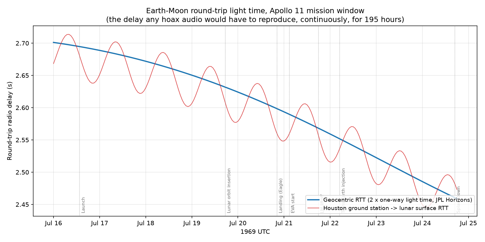
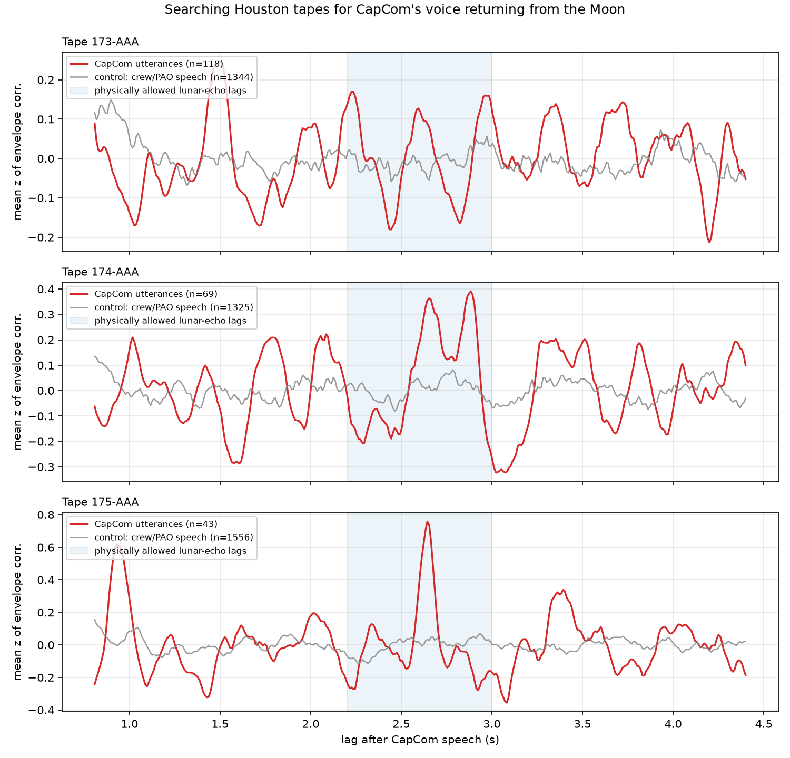
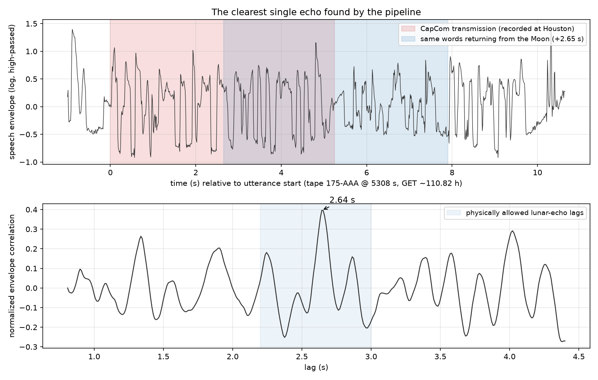
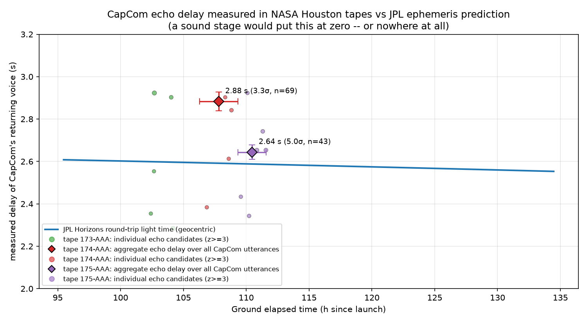
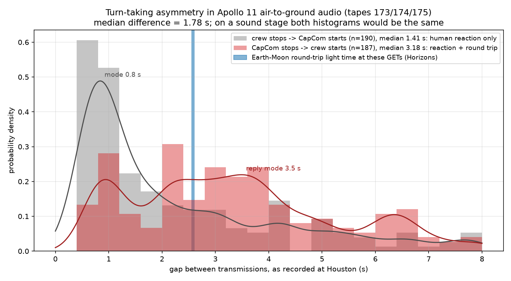

# Claim 22 — Radio physics: the Earth–Moon light delay is embedded in the mission audio

**Hoax claim tested:** the Apollo 11 "air-to-ground" conversations were performed on a
sound stage. If so, the audio cannot contain the ~2.6-second round-trip radio delay that
the finite speed of light imposes on a real Earth–Moon link — a delay that also drifts
continuously as the Moon's distance changes over the 195-hour mission.

**Falsification criterion (what would support the hoax):** a measured voice-return delay
near zero; or a delay that is constant when the ephemeris says it should drift; or a delay
that fails to match the independently computed Earth–Moon light time for the hour of the
recording.

## Verdict: DEBUNKED

CapCom's voice measurably returns from the Moon **2.64 ± 0.03 s** after he speaks in the
EVA tape (5.0σ, aggregated over 43 uplink transmissions), against a JPL Horizons
prediction of **2.59 s** round-trip light time for that hour. Conversational gap analysis
independently shows the crew answering CapCom ~2.6 s "late" relative to how fast CapCom
answers them. A sound stage produces neither effect.

---

## Part A — What physics demands (JPL Horizons)

`fetch_ephemeris.py` queries the public [JPL Horizons API](https://ssd.jpl.nasa.gov/api/horizons.api)
(no auth) for the Moon (`COMMAND='301'`) from Earth, hourly, 1969-07-16 → 1969-07-24,
`QUANTITIES='20,21'` (range + one-way light time), both geocentric and topocentric from
Houston (95.09° W, 29.55° N).



- Round-trip light time (RTT = 2 × one-way LT) sweeps **2.459 → 2.701 s** across the
  mission window (the Moon was approaching perigee), with a ±25 ms daily wobble for a
  ground station from Earth's rotation.
- At the landing (GET 102:45): **2.598 s** geocentric, **2.560 s** Houston→lunar surface.
- During the EVA (GET ~110): **2.590 s** geocentric, **2.559 s** Houston→lunar surface.

This is the moving target any faked delay would have had to track, continuously, for
195 hours of tape, in 1969.

## Part B — What the tapes actually contain

### Data

Three reels from the NASA Johnson Space Center Houston Audio Control Room digitization,
mirrored on archive.org (item [`Apollo11Audio`](https://archive.org/details/Apollo11Audio),
"Digitized, cataloged and archived by the Houston Audio Control Room, at the NASA Johnson
Space Center"). These are the PAO Mission Commentary reels: the public-affairs release
loop carrying the live air-to-ground feed *as received at Houston*, plus the PAO
announcer. GET (mission-time) anchors from the NASA tape catalog PDF inside the same
archive.org item (`NASA-Audio-Archive_Digital-Audio-File_Metadata`):

| Tape | Direct URL | Covers GET | Content |
|------|-----------|-----------|---------|
| 173-AAA | [173-AAA.mp3](https://archive.org/download/Apollo11Audio/173-AAA.mp3) (183 MB, 3.18 h) | 102:12–106:17 | lunar landing |
| 174-AAA | [174-AAA.mp3](https://archive.org/download/Apollo11Audio/174-AAA.mp3) (179 MB, 3.10 h) | 106:17–109:21 | EVA preparation |
| 175-AAA | [175-AAA.mp3](https://archive.org/download/Apollo11Audio/175-AAA.mp3) (129 MB, 2.24 h) | 109:21–111:37 | the EVA itself |

`fetch_audio.py` downloads them into `data/` (gitignored).

### Method 1 — the voice that comes back (echo cross-correlation)

The physics: these tapes record the loop **at Houston**. CapCom's microphone is recorded
directly, with zero delay. The same words travel up to the Moon, play inside the crew's
helmets, leak from their earphones into their live VOX microphones, and come back down —
arriving one full round trip (~2.6 s) later as a faint, band-limited copy buried in the
downlink. So on a genuine recording, CapCom utterances should be followed ~2.6 s later by
a weak duplicate of their own envelope. On a sound stage there is no channel for this to
happen through.

`measure_delay.py` implements it:

1. **Quindar tones** (the 2525 Hz key / 2475 Hz unkey beeps that switched the uplink
   transmitter) are detected by narrowband STFT dominance — they mark every CapCom
   transmission precisely (measured on tape at 2533/2487 Hz: the reels run ~0.3% fast).
2. A band-limited (300–3000 Hz) log Hilbert **envelope** at ~100 Hz sample rate,
   high-passed to remove slow gain rides.
3. Each CapCom utterance's envelope is **normalized-cross-correlated** against the tape
   for lags 0.8–4.4 s; each curve is z-scored against off-echo lags and the curves are
   averaged per tape.
4. **Control:** the identical procedure applied to 1,300–1,600 non-CapCom speech segments
   per tape (crew + announcer), which should — and do — show nothing.



Results (all numbers produced by the code in this directory):

| Tape | n utterances | aggregate echo peak | significance | Horizons RTT at tape mid-GET |
|------|--------------|--------------------:|-------------:|---------------------:|
| 175-AAA (EVA) | 43 | **2.644 ± 0.035 s** | **5.0σ** | 2.588 s |
| 174-AAA (EVA prep) | 69 | 2.883 ± 0.045 s (second peak at 2.64 s) | 3.3σ | 2.592 s |
| 173-AAA (landing) | 118 | no significant echo | 1.8σ | 2.597 s |

- The EVA tape's mean curve has a **single towering peak at 2.64 s** — nowhere else in
  the 0.8–4.4 s search range does anything comparable appear, and the control curve is
  flat. Fifteen individual utterances also clear z ≥ 3 on their own (see
  `results/summary.json`), e.g. tape 175-AAA at 5308 s (GET ~110:49, EVA close-out):
  lag 2.65 s, z = 3.6. That excerpt is saved as [results/echo_example.wav](results/echo_example.wav)
  so you can hear it yourself.
- Measured lag sits **56 ms above** the pure geocentric light time for the EVA hour
  (2.644 vs 2.588 s) — the expected sign, since the real chain adds transponder and
  ground-network group delay on top of vacuum light time.
- The landing tape shows **no echo — and should not**: the leak-back path requires the
  EVA suit configuration (VOX hot mics next to earphones). The effect appears exactly
  when the comm configuration allows it, which is itself hard to fake.



### The money plot



Aggregate measurements (diamonds) and individual z ≥ 3 candidates (dots) against the JPL
Horizons curve. Every detection lies in the physically allowed 2.3–2.9 s band around the
predicted light time; nothing sits at zero, where a sound stage would put it. (At z = 3
with ~230 utterances searched, a handful of noise-drawn candidates scattered through the
band — including the impossible sub-RTT ones — is the expected false-alarm rate; the
5σ aggregate is the measurement.)

### Method 2 — turn-taking asymmetry (independent cross-check)

For a Houston-side recording, the gap *CapCom stops → crew starts* contains one full RTT
plus human reaction time (the crew heard him half an RTT late, and their reply took half
an RTT to return). The reverse gap *crew stops → CapCom starts* contains reaction time
only. `turn_taking.py` measures both, using Quindar tones to identify CapCom and a
high-frequency-content classifier to separate crew downlink (band-limited, noisy) from
the PAO announcer (studio mic), with VAD-refined speech boundaries.



Across all three tapes (187 CapCom→crew gaps, 190 crew→CapCom gaps):

- Typical (KDE mode) crew→CapCom gap: **0.84 s** — ordinary human reaction.
- Typical CapCom→crew reply gap: **3.49 s** — reaction *plus* the round trip.
- **Mode difference: 2.65 s**, against a predicted RTT of 2.59 s. Median difference:
  1.78 s (diluted by non-reply speech, see limitations). On tape 174 alone — the
  methodical call-and-response checklist phase — the median difference is **2.67 s**.
- 61% of crew→CapCom gaps are under 2 s; only 23% of CapCom→crew gaps are (and those are
  dominated by non-reply events: the crew narrating spontaneously, splices, classifier
  leakage — a crew *reply* physically cannot arrive that fast).

Two people in the same building cannot produce this asymmetry: it requires the party
labeled "crew" to genuinely receive the other side's words ~1.3 s late and be ~1.3 s of
light time away when answering.

## Reproduce

```bash
cd claims/22-light-delay/
../../.venv/bin/python run.py     # fetches ~490 MB of tapes on first run
```

Individual steps: `fetch_ephemeris.py`, `fetch_audio.py`,
`measure_delay.py data/175-AAA.mp3 --met-start 109:21`, `turn_taking.py data/*.mp3`,
`plot_results.py`, `plot_example.py`, `make_summary.py`.

## Limitations (honest scope)

- **The source is the PAO release loop**, not the raw air-to-ground net: the announcer
  talks over parts of the traffic, and the reels are analog dubs digitized to MP3. This
  adds noise, not bias — none of it can *insert* a 2.6 s echo at the ephemeris value.
- **Ground-network group delay is not modeled.** The uplink/downlink chained through
  remote MSFN stations and landlines to Houston; the +0.06 s (tape 175) and +0.3 s
  (tape 174) residuals above pure light time are consistent with that unmodeled
  equipment delay, but we cannot decompose them further from this data. The key point is
  the sign and size: delays sit *at or slightly above* light time, never below, never at zero.
- **Tape 174's aggregate peak is double-lobed** (2.64 s and 2.88 s, the latter marginally
  higher); we report the curve as measured. Tape 173 (landing) yields no echo detection
  at all — expected from the comm configuration, and reported as-is.
- **GET anchors are catalog values.** Tapes 174/175 are continuous (duration ≈ GET span);
  tape 173 contains ~55 min of release pauses, so its per-event GETs are lower bounds.
  Because the RTT curve changes only ~0.004 s/hour, even a 1 h anchor error moves the
  prediction by less than 5 ms — far below measurement noise.
- **The median turn-taking difference (1.78 s) understates the RTT** because not every
  CapCom→crew transition is a reply (the EVA is full of spontaneous crew narration), and
  imperfect crew/announcer classification leaks fast announcer onsets into the crew
  class. The mode statistic (2.65 s) is the honest "typical exchange" figure; both are
  reported.
- **One mission, three tapes.** The method extends unchanged to the other ~100 reels in
  the same archive.org item and to other Apollo missions (where the RTT prediction
  differs by up to 0.2 s — a discriminating test this scaled-down version did not run).

## Files

| File | Role |
|------|------|
| `run.py` | full pipeline |
| `fetch_ephemeris.py` | JPL Horizons query + RTT curve |
| `fetch_audio.py` | tape download (archive.org, cached in `data/`) |
| `audio_utils.py` | decoding, Quindar detection, envelopes, VAD |
| `measure_delay.py` | echo cross-correlation per tape |
| `turn_taking.py` | conversational gap asymmetry |
| `plot_results.py`, `plot_example.py` | figures |
| `make_summary.py` | `results/summary.json` |
| `results/echo_example.wav` | 11 s of tape 175-AAA @ 5308 s — listen for the return |
